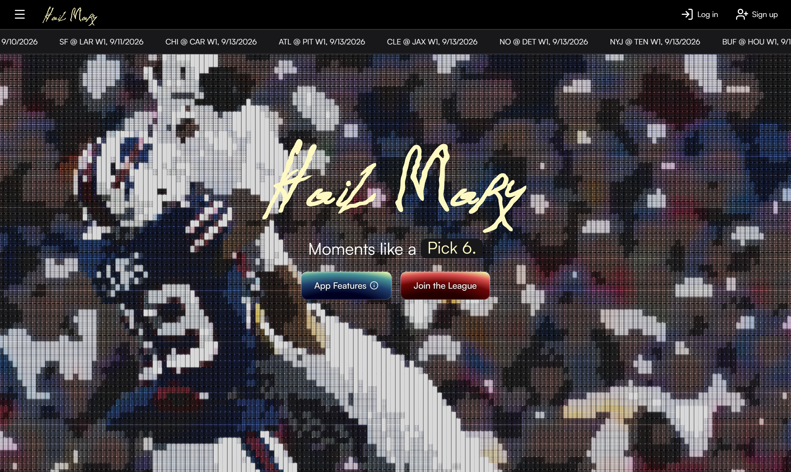
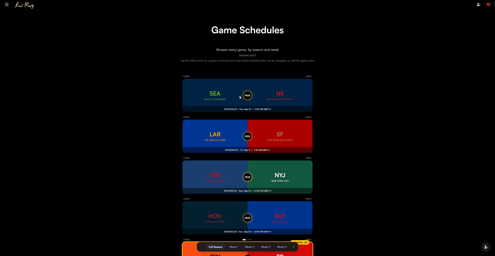

# Hail Mary - NFL Pick'em

A full-stack NFL predictions app: pick a winner for every game, build a streak, climb a public leaderboard against other players, and analyse prediction performance over a season. Built as a portfolio project to practice shipping a complete product - real auth, a real external data source, scheduled background jobs, and a production deployment

**Live app:** https://nfl-pickem-weld.vercel.app




<!-- Add: games page with a pick made, profile stats, leaderboard -->

## Features

- Sign up with email/password or Google, then pick a winner for any upcoming game
- Picks lock automatically at kickoff - no changing your mind once a game starts (time conversion is in progress)
- Once a game finishes, picks are graded automatically and roll up into per-user stats: correct/incorrect picks, current streak, longest streak, and accuracy
- A public leaderboard ranks every player by accuracy, current streak, or longest streak
- User profile page shows a statistics dashboard: full pick history heatmap, a weekly accuracy trend chart, and a breakdown of win-rate
- The full NFL schedule and finals scores are kept in sync automatically - no one has to enter game data by hand

## Tech stack

**Frontend**
- **Next.js** (App Router) + **TypeScript**
- **Tailwind** CSS v4 + **daisyUI**
- **shadcn/ui** for base components (Buttons, Cards), built on Radix primitives
- **Motion** (motion/react) for reveal/entry animations

**Backend**
- PostgreSQL (hosted on **Neon**) via **Prisma** ORM, using up-to-date Prisma's Neon driver adapter for serverless-friendly connections
- **Better Auth** for authentication (email/password + Google OAuth), backed by its own Prisma-managed tables
- Next.js Route Handlers as the API layer
- **Vitest** for unit testing the core streak/accuracy logic
- **API-first, tested before the UI existed** - every route was built and manually verified against real requests in Postman, including deliberately testing rejection paths (locked picks, invalid teams, duplicate signups), before any frontend page ever called it

**Infrastructure**
- Deployed on **Vercel**
- Vercel Cron triggers a scheduled route daily to pull fresh game data and scores
- Game data sourced from ESPN NFL API - public scoreboard endpoint (undocumented - see [Architecture](#architecture--how-it-works))

## Notable Features

- **Pick submission with kickoff locking** - the API rejects a pick the moment a game's kickoff time has passed, checked server-side, not just hidden in the UI
- **Automatic grading** - A prediction's result is derived on read by comparing the pick against the game's final score
- **Streaks & accuracy** - current streak, longest streak (with its squares highlighted yellow on the profile's pick-history heatmap), and accuracy; all computed from the same underlying grading logic shared between the profile page and the leaderboard
- **Leaderboard** - accuracy is ranked by default; but can be ordered by current streak, or longest streak; no auth requirement, since standings are meant to be public
- **Season-aware labels** - pages display the current season, derived from real game data rather than hardcoded per page
- **Scheduled data sync** - a cron-triggered route auto re-syncs the current and previous week's games daily in case of late game entries

## Architecture / how it works

**Data flow for scores and grading:**

```
Vercel Cron (daily)
  → GET /api/cron/sync-games (cron-secret-protected)
    → fetchWeekGames() - ESPN's scoreboard endpoint
    → upsert into the Game table (score, status, kickoff time)

User visits their profile / the leaderboard
  → getGameResultsForUser() joins each Prediction with its Game
    → compares pickedTeamId against the winning team
    → returns each pick as "correct" / "incorrect" / "scheduled" / "cancelled"
  → computeStats() reduces pick results into currentStreak / longestStreak / accuracy
```

A few decisions worth calling out:

- **Grading isn't stored - it's computed on every read.** A `Prediction` row only ever stores which team the user picked. Whether that pick was correct is derived at request time from the linked `Game`'s final score. This avoids ever having a prediction and a grade fall out of sync, at the cost of a bit more computation per request
- **The ESPN integration is isolated to one file.** ESPN doesn't offer an official public API - the scoreboard endpoint used here is unofficial and undocumented. It is contained in `src/lib/espn.ts`; nothing else in the app touches ESPN's response shape directly, so if the endpoint ever changes, only one file needs to change
- **The cron route only re-syncs two weeks, not the whole season.** A full-season backfill makes 18 sequential API calls - too slow for a serverless function with a short timeout. The daily cron job instead re-syncs just the current week and the one before it (to catch any late-finishing games), which is enough to keep live scores accurate without re-checking weeks that are already final
- **Streak highlighting has to survive gaps.** The pick-history heatmap needs to highlight the user's longest streak, but the "longest streak" is computed only over graded (correct/incorrect) picks - scheduled and cancelled games sit in between them in the real chronological sequence. The API translates streak indices from the graded-only subsequence back into indices on the full game list, so the highlight lands on the right games even with gaps

## Local Set Up

```bash
git clone https://github.com/aaron99leung/nfl-pickem.git
cd nfl-pickem
npm install
```

Create a `.env` file with:

```
DATABASE_URL=            # Postgres connection string (Neon or any Postgres works)
BETTER_AUTH_SECRET=      # random secret, e.g. `openssl rand -hex 32`
BETTER_AUTH_URL=         # http://localhost:3000 for local dev
GOOGLE_CLIENT_ID=        # from Google Cloud Console OAuth credentials
GOOGLE_CLIENT_SECRET=    # from the same Google Cloud Console OAuth client
CRON_SECRET=             # only needed to test the cron route locally
```

Set up the database and seed the 32 NFL teams:

```bash
npx prisma migrate dev
npx tsx prisma/seed.ts
```

Pull in the current season's schedule:

```bash
npx tsx prisma/sync-games.ts
```

Then run the dev server:

```bash
npm run dev
```

## What I learned

- **Working against an undocumented third-party API** - ESPN's scoreboard endpoint isn't an official public API, so there's no guaranteed stability; pushing me to isolate all of that risk behind one function (`fetchWeekGames`) rather than letting ESPN's response shape leak into the rest of the app
- **Designing around eventual consistency** - Game results, and therefore grading, change on ESPN's schedule, not the user's. Computing grades on read instead of storing them turned out to be simpler to reason about than trying to keep a cached "correct/incorrect" field in sync via webhooks or triggers
- **Serverless functions have real constraints.** A naive "resync the whole season" cron job would run 18 sequential external API calls - comfortably past a serverless function's timeout. Scoping the cron job to just the current and previous week was a direct optimised response to that constraint
- **Breaking a circular dependency into sequential steps** - adopting Prisma 7 while wiring up Better Auth created a real chicken-and-egg problem: Better Auth's CLI needed a working Prisma client to generate the `User` model, but Prisma couldn't generate a working client until `User` existed, since `Prediction` already referenced it. Temporarily isolating that one relation broke the cycle - generate the client, let Better Auth fill in the missing model, then restore the relation

## Roadmap

- Season-scoped standings - Streaks, accuracy, and the leaderboard are currently one continuous all-time history with no season boundary; splitting them per season (like most real pick'em leagues) is a natural next step
- Playoff bracket support - picks currently only cover the regular season; extending grading and pick submission to the postseason (Wild Card through the Super Bowl) would need bracket-aware logic, since who's even playing each round depends on earlier results
- Head-to-head comparison view between two users and user public profile with in-depth statistics dashboards
- User settings - allowing them to change passwords and username etc.
- Team standings page - grouped by conference and division - win-loss records derived from `FINAL` games, plus playoff clinch indicators and legends; real NFL clinching scenarios involve tiebreakers, division vs. wild-card races, and strength-of-schedule comparisons for the website to be closer to a small rules engine
